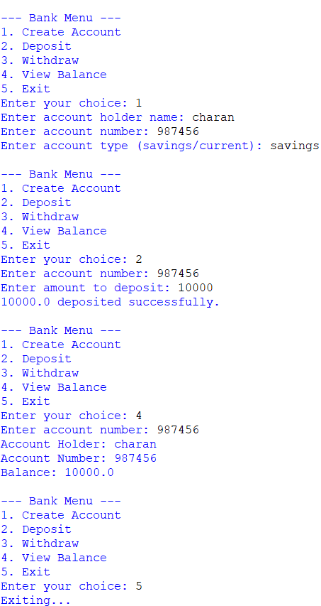

# 🏦 Bank Management System

A console-based **Bank Management System** developed in **Python** using **Object-Oriented Programming (OOP)** concepts. The application allows users to create bank accounts, deposit and withdraw money, check account balances, and demonstrates real-world banking operations through a simple menu-driven interface.

---

## 📌 Features

- Create Savings and Current Accounts
- Deposit Money
- Withdraw Money
- Check Account Balance
- Overdraft Facility for Current Accounts
- Exception Handling
- Menu-Driven Console Interface

---

## 🛠️ Technologies Used

- Python 3
- Object-Oriented Programming (OOP)

---

## 📚 OOP Concepts

- Classes & Objects
- Inheritance
- Encapsulation
- Polymorphism
- Method Overriding
- Exception Handling

---

## ⚙️ Functionalities

- Create Account
- Deposit Amount
- Withdraw Amount
- View Balance
- Exit Application

---

## 📂 Project Structure

```text
Bank-Management-System/
│── mini_project.py
│── BANK.png
│── README.md
```

---

## ▶️ How to Run

Clone the repository:

```bash
git clone https://github.com/Charan140205/Bank-Management-System.git
```

Go to the project directory:

```bash
cd Bank-Management-System
```

Run the project:

```bash
python mini_project.py
```

---

## 📷 Project Screenshot

<p align="center">
  
</p>

---

## 🎯 Learning Outcomes

- Applied Python Object-Oriented Programming concepts.
- Implemented a banking simulation project.
- Improved problem-solving and logical thinking.
- Learned exception handling and input validation.

---

## 🔮 Future Enhancements

- User Authentication
- Transaction History
- Database Integration
- GUI using Tkinter
- Interest Calculation
- Secure Data Storage

---

## 👨‍💻 Author

**K.Charan**

GitHub: https://github.com/Charan140205

⭐ If you like this project, don't forget to **Star** the repository.
